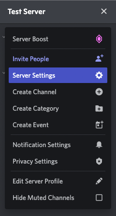
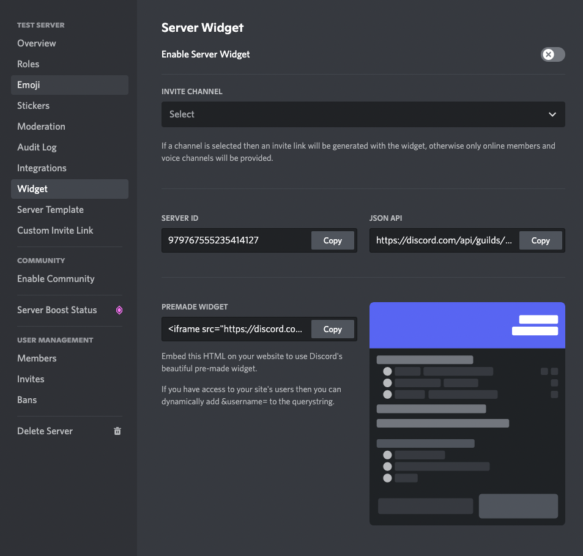
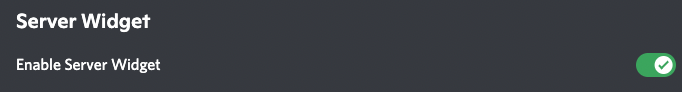
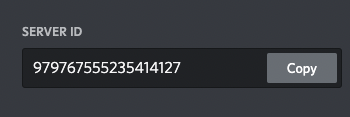
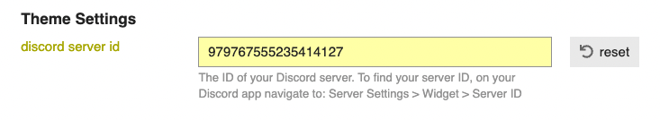
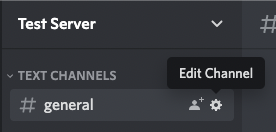
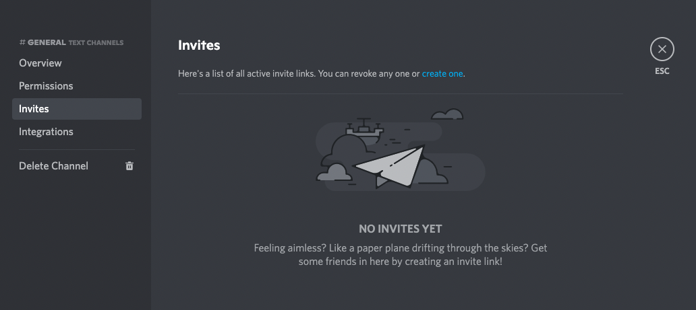
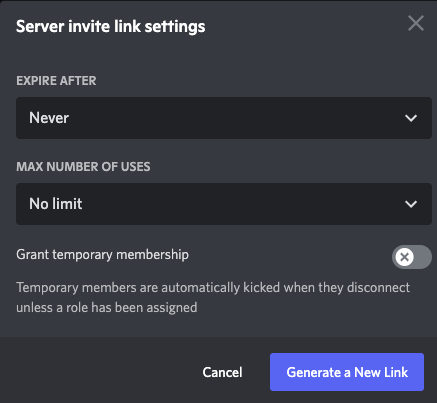

# Discourse Discord Widget

## 🔍 Overview

This theme component allows you to add a Discord Widget as a dropdown to your Discourse site header.

## ⚙️ Configuration & Setup

### How to Setup the Component

#### Add your Server

To find your Server ID navigate to:

1. Server Settings
   - 
2. Widget Settings
   - 
3. Enable Server Widget
   - 
4. Copy Server ID
   - 
5. Paste it in your theme settings:
   - 

#### Add your Invite URL

On mobile, the Discord widget is replaced with an invite link so that users can open the server in the Discord app itself. This requires the invite url.

To generate an invite url:

1. Edit a specific channel setting
   - 
2. Select Invites on the Left Sidebar
   - 
3. Select "Create One"
   - 
4. Set Invite to Expire After: "Never":
   - 
5. Select Generate New Link Button
6. Copy the generated new link to the theme setting entitled: `discord_invite_url`

### Settings

The theme allows for a variety of settings. Below are some details on each setting.

#### `require_login`

Select to only shows the widget to logged in users.

#### `minimum_trust_level`

Based on Discourse's Trust Level System [(more info)](https://blog.discourse.org/2018/06/understanding-discourse-trust-levels/). Enter a number value representing the trust level a user must be at in order to see the widget.

#### `require_staff`

Select to only show the widget to staff members (moderators and admins).

#### `required_groups`

Use the dropdown to select one or more groups. Users in **any** of the groups listed will be able to see the widget.

#### `theme`

Toggle the theme of the Discord widget. Select either light/dark to force set a theme or select 'auto' to have the theme automatically be chosen based on the user's system.